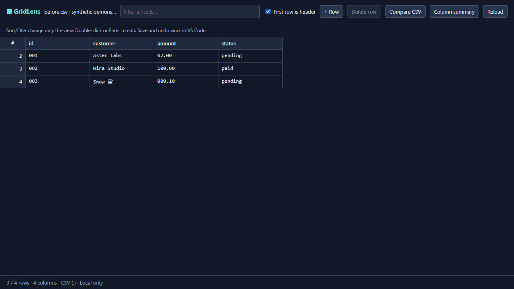
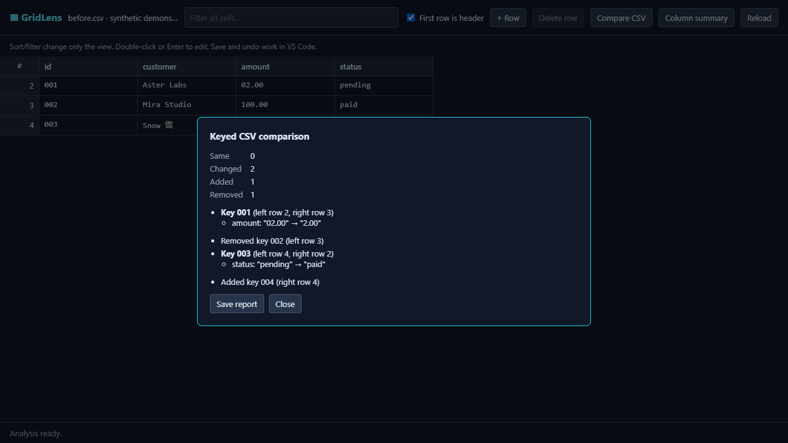

# GridLens — keyed CSV comparison without rewriting your files

Compare CSV/TSV snapshots by a unique key, edit delimited files as a grid, and browse XLSX values inside VS Code. Comparison uses literal strings: `001` is not `1`, and `02.00` is not `2.00`.

## Why use it?

- Find changed, added and removed records even when rows are reordered.
- Duplicate or blank keys block matching instead of creating ambiguous results.
- Match columns by exact header name when header mode is enabled; column order may differ.
- Inspect column statistics and save a JSON report, without rewriting either comparison source.
- All current CSV editing, comparison, and summary features are free. There is no active paid checkout.
- **Check structure** reports uneven rows and blank/duplicate/missing headers by source row/column, with no automatic padding or repair.

These images show the same interface in a synthetic local preview. File selection and report saving are validated separately inside VS Code; no customer spreadsheets are shown.

## Getting started

Try the [local-processing browser demo and documentation](https://dilojbusiness-blip.github.io/gridlens/compare-csv-by-key.html). It uses the same open-source comparison engine at smaller limits; it is not an online storefront or paid service.

Right-click a CSV, TSV or XLSX file → **GridLens: Open as Grid**. Alternatively, use **Reopen Editor With…** from the editor tab. GridLens does not replace your default editor automatically.

### Compare two snapshots

1. Open `samples/before.csv` with GridLens and enable **First row is header**.
2. Click **Compare CSV**, choose `samples/after.csv`, and choose `id` in both key-column prompts.
3. Result: two changed records, one added, one removed. Row reordering alone is ignored, but `02.00` versus `2.00` is reported because values are not coerced.
4. Try `samples/duplicate-keys.csv`: matching is blocked and the duplicate source rows are shown.

The current file uses its in-editor text; the second file is read from its saved UTF-8 disk snapshot. Comparison and summaries include the full source data, not just the sorted/filtered display. Tables must be rectangular. In header mode, schemas need the same exact, nonblank, unique names. Neither file is merged or automatically repaired.

### Check structure before matching

Enable **First row is header** only if the first record contains column names, then click **Check structure**. Reports show expected versus actual column counts and header issues. Comparisons automatically run this check before asking for key columns. Diagnostics contain row/column positions, not cell values; up to 100 issues per table are saved, and up to 20 are shown. Fix the source deliberately rather than assuming missing fields should be padded.

- CSV/TSV: double-click a cell or press Enter to edit. Enter applies; Shift+Enter inserts a newline. Save and undo use VS Code's document system.
- Add a blank row or delete a selected source row.
- Filter rows, sort column views, and optionally treat the first row as a header. These operations change the display, not the underlying order in the file.
- XLSX: choose a worksheet from the selector. Values are read-only; no workbook data is written.
- Both rows and columns render only the visible slice.
- Select a cell, then click **Column summary** to inspect that column. Numeric aggregates use finite decimal/scientific values; identifiers are not changed.

## Limits and privacy

No telemetry, remote scripts, analytics or spreadsheet uploads. Current free features make no network calls. Paid activation is disabled in this release; future activation will contact Lemon Squeezy with the license key and instance ID only, never spreadsheet content. Files stay in your local/remote VS Code workspace; if using VS Code Remote, parsing runs on that workspace's extension host.

Comparison JSON contains exact counts and up to 1,000 sampled changes; the dialog shows up to 100 of those. Saved reports can contain sensitive cell values: choose an appropriate local destination before sharing them. Row indices in JSON are zero-based, while the dialog displays one-based row numbers.

CSV limits: 50 MiB of decoded text, 100,001 rows, 512 columns, one million cells. Malformed quoting is rejected rather than silently changed. Existing cell spelling and quotes are retained; VS Code itself may normalize mixed line endings or encoding when saving.

XLSX limits: 10 MiB compressed, 30 MiB unpacked, 10 MiB per ZIP entry, 100 sheets and one million cells. Some valid complex workbooks may exceed these safety limits. Encrypted, ZIP64 and split archives are unsupported. Charts, formatting and merge layout are not rendered. Dates use ISO text. Formulas are not calculated; cached values are displayed, or the formula when a cached result is absent. Close and reopen after external workbook changes.

**v0.2.1 is free. No live Pro product or checkout is available.** Internal test checkout/licensing has been exercised, but prepared paid-export and license foundations remain disabled in the public release. XLSX editing, calculations, automatic merging, and full comparison exports beyond the sample limit are not included.

## Support

Contact dilojbusiness@gmail.com. Do not attach sensitive spreadsheets; provide a small anonymized example.

## Develop and test

Node.js 22 is used locally. Install with `npm ci`, run `npm run check` and `npm test`. `scripts/fidelity-benchmark.cjs` measures synthetic GridLens-only parser round trips, not competitor performance or customer demand. `tests/host/index.cjs` exercises real VS Code editing and report export in an isolated profile. Core source is MIT; bundled upstream notices are in `THIRD_PARTY_NOTICES.txt`.